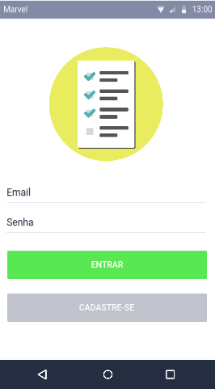

# Prototipo do aplicativo Avaleasy: _Release 01_

## Features deste prototipo

- Login e cadastro de usuário **professor**
- Perfil do professor
- CRUD dos modelos de avaliação

## Prototipo de alta fidelidade

### Login e cadastro

### Perfil

### Criar modelo

### Listar modelos (de um usuário especifico)

### Editar modelo

### Deletar modelo

